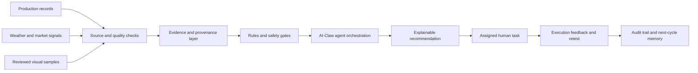

# Showcase Architecture

The design principle is simple: an assistant may explain and coordinate, but it must not bypass authorization or turn an unverified signal into a claimed execution result.

The public repository shows the boundary and the reasoning pattern. It does not publish the private service implementation, production schemas, customer adapters, or model-provider credentials.

## Core concepts

| Concept | Purpose |
| --- | --- |
| Source record | Identifies where a value came from and when it was collected |
| Quality gate | Prevents incomplete or unreviewed records from entering a decision path |
| Rule gate | Handles high-risk operational boundaries deterministically |
| Agent explanation | Summarizes evidence, uncertainty, and the next safe action |
| Task closure | Records owner, deadline, feedback, retest, and audit reference |

